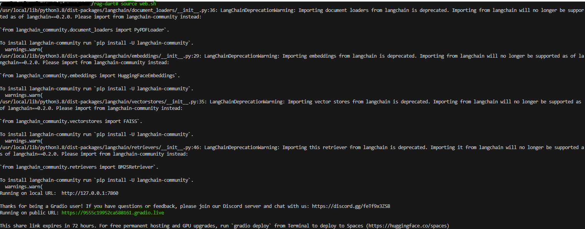

# 🤖 DART QA Chatbot with ChatGPT & LangChain

## 1. 개요 📜
이 프로젝트는 **ChatGPT**와 **LangChain**을 사용하여 **DART 자료**에 대한 질의응답 챗봇을 구현합니다. 사용자 인터페이스는 **Gradio**를 통해 간단하고 직관적으로 제작되었습니다.

### 주요 기능:
- **ChatGPT 기반 RAG**: 문서의 각 페이지를 ChatGPT를 사용하여 요약하고, 이 요약을 바탕으로 RAG(Retrieval-Augmented Generation)가 작동합니다. 📘 (참고: 비용 문제로 **삼성SDS**, **LG CNS**, **롯데정보통신** 세 개 기업만 지원합니다.)
- **LangChain 기반 RAG**: Embedding 모델을 사용하여 문서를 벡터화하고, 이 벡터 정보를 바탕으로 RAG가 작동합니다. �� (docs 폴더 내 전체 기업 지원 가능)

## 2. 실행 방법 🚀
아래 명령어를 터미널에 입력하면 데모 서비스의 웹 주소를 확인할 수 있습니다. 얻어진 주소로 접속하면 데모를 사용할 수 있습니다:
```bash
python web.sh
```


## 3. 파일 및 폴더 설명 📂

### 폴더 구조
- **docs**: DART에서 수집한 PDF 모음입니다.
- **db**: ChatGPT RAG와 LangChain 기반 RAG를 위해 사전 구축한 데이터를 포함합니다.
  - **faiss**: BERT 기반 모델로 생성한 벡터 정보를 기업별로 저장하여 RAG에서 사용합니다.
  - **summary**: ChatGPT로 docs의 각 페이지를 요약한 파일로, 요약 기반 RAG에서 사용합니다. (삼성SDS, LG CNS, 롯데정보통신 세 개 기업만 진행)

### 주요 파일
- **db/docsearch.pkl**: docs의 문서를 청크 단위로 분리한 파일로, embedding과 summary 과정에 사용됩니다.
- **api.py**: ChatGPT API와의 연동을 처리합니다.
- **data_management.py**: 문서의 벡터 정보 또는 요약 정보를 구축하고 저장하는 모듈입니다.
- **rag.py**: 질문에 적합한 문서를 매칭하고 답변을 생성하는 RAG 전반에 대한 로직을 구현합니다.
- **qa_engine.py**: 데모 사이트에서 RAG를 실행하기 위해 필요한 모듈들을 결합합니다.
- **config.json**: RAG 작동에 필요한 정보를 관리합니다. 여기에는 OpenAI의 개인 API 키(https://platform.openai.com/account/api-keys)와 Hugging Face의 토큰(https://huggingface.co/docs/hub/security-tokens)이 필요합니다.
- **web.py**: 데모 사이트 코드로, qa_engine 모듈을 사용하여 작동합니다.
- **web.sh**: web.py 실행 명령어 파일입니다.

